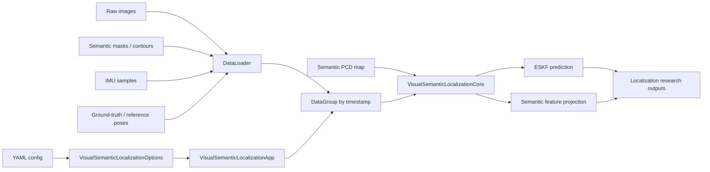

# Pandora SLAM

[](https://github.com/zhangnanyue/pandora_slam/actions/workflows/cmake.yml)
[](https://github.com/zhangnanyue/pandora_slam/releases)
[](LICENSE)

Pandora SLAM is a research-oriented C++ SLAM workspace for studying LiDAR, camera, IMU and semantic-map based localization. The repository is focused on reusable building blocks for multi-sensor geometry rather than a packaged production system.

The current codebase includes:

- LiDAR-camera alignment utilities based on edge and plane observations.
- A visual-semantic localization pipeline that packs synchronized image, semantic contour, IMU and ground-truth inputs.
- An Error-State Kalman Filter (ESKF) module for inertial prediction and state handling.
- Camera model, YAML parsing, Eigen/PCL/OpenCV utilities, and small examples for configuration parsing.
- CMake targets that keep core modules buildable as shared libraries.

## Why This Exists

Modern robotics stacks often need to connect classical geometry, semantic perception and inertial state estimation. Pandora SLAM is a personal research codebase that documents those integration points in a compact form: calibration loading, coordinate-frame transforms, semantic feature preparation, map projection, and ESKF prediction.

The project is useful for researchers or students who want to inspect how a semantic localization prototype is structured before adapting it to their own datasets.

## Repository Status

This is an active research prototype. The public repository intentionally does not include private datasets, generated debug outputs, build artifacts, or machine-specific paths. Example configuration files use placeholders such as `<dataset_root>` and `<output_root>`; replace them with local paths before running experiments.

## Pipeline Overview



The pipeline separates configuration, data loading, synchronized frame packaging and core state-estimation logic. This keeps the reusable pieces easy to test independently while leaving dataset-specific paths outside the public repository.

## Modules

| Path | Purpose |
| --- | --- |
| `src/modules/common_utils` | Logging, timing, Eigen, SO(3), PCL and YAML helper utilities. |
| `src/modules/camera_model` | Pinhole camera model and projection support. |
| `src/modules/data_loader` | Load timestamped image, IMU, pose and semantic-contour data. |
| `src/modules/ESKF` | Error-State Kalman Filter primitives and prediction/update support. |
| `src/modules/lidar_visual_alignment` | LiDAR-camera alignment using projected point cloud structure and image edges. |
| `src/modules/visual_semantic_localization` | Visual-semantic localization app/core configuration and processing flow. |
| `run/visual_semantic_localization` | CLI entry point for running the localization pipeline from a YAML config. |
| `tests/test_opencv_yaml_parse` | YAML parser test target. |

## Build

### Dependencies

Tested with Ubuntu-style C++ tooling and the following libraries:

- CMake 3.10+
- C++17 compiler
- Eigen3
- OpenCV
- PCL 1.8+
- Ceres Solver
- yaml-cpp

Install commands vary by distribution. On Ubuntu, the dependency set is typically available through `apt` plus a Ceres installation compatible with your system.

### Configure and Compile

```bash
cmake -S . -B build -DCMAKE_BUILD_TYPE=Release
cmake --build build -j$(nproc)
```

The top-level build currently enables the reusable modules and the visual-semantic localization runner. Generated files under `build/`, `install/`, `debug/`, `results/`, `logs/`, and dataset directories are intentionally ignored.

## Run

Prepare a dataset folder and update:

```text
src/modules/visual_semantic_localization/config/visual_semantic_localization.yaml
```

Then run:

```bash
./build/run/visual_semantic_localization/visual_semantic_localization_main \
  src/modules/visual_semantic_localization/config/visual_semantic_localization.yaml
```

The expected dataset layout is:

```text
<dataset_root>/
  params/
  raw_images/
  semantic_images/
  semantic_map/
  semantic_contours.txt
  imu_data.txt
  fast_lio.txt
```

The `params/` directory should contain camera intrinsics and LiDAR/IMU/camera extrinsic calibration files referenced by the YAML config.

## Open Source Program Fit

Pandora SLAM is not a high-adoption package yet. Its fit for open-source support is based on technical scope: robotics localization, multi-sensor calibration, semantic-map integration, and the maintenance work required to make research code reproducible.

API credits would be useful for:

- turning experiment notes and debug logs into issue summaries;
- generating clearer documentation for coordinate frames and dataset expectations;
- reviewing C++ changes for geometry, Eigen and CMake mistakes;
- creating small tests around YAML parsing, transforms and ESKF behavior;
- improving release notes and reproducibility checklists.

Codex Security would be useful for reviewing public release hygiene: generated artifacts, machine-specific paths, dataset boundaries, dependency updates and scripts that process user-provided files.

## Roadmap

See [docs/ROADMAP.md](docs/ROADMAP.md) for the public maintenance plan.

## License

MIT License. See [LICENSE](LICENSE).
